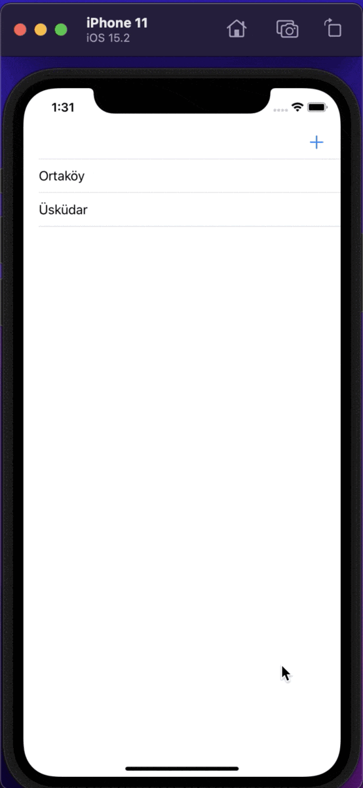

# Map Application
You can save the location of the places you go on the map and add names and notes. The data is saved on local database. Then you can enter the application any time and you can see these places on the map and get directions.
 
 

